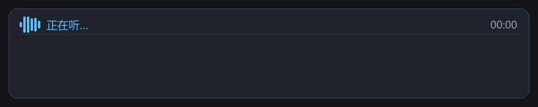

# EtherealFlow · 缥缈心流

**真流式语音输入法** · 本地模型 · 语音不出你的机器

> 按住热键说话，屏幕上**实时看着字长出来**；松开后把干净的文本注入当前输入框。
> 识别模型跑在**你自己的机器上**，语音不经过任何云端。



`Windows 10/11` · `WSL2` · `Python` · `MIT`

---

# 中文

## 一、为什么叫「真流式」

市面上多数语音输入是**说完才出字**：你要按住说完整段、松开、再等一两秒，屏幕才一次性跳出结果。
说错了只能重来 —— 因为你看不到过程。

EtherealFlow 是**边说边出**：

| | 传统语音输入 | EtherealFlow |
|---|---|---|
| 出字时机 | 松手后一次性出现 | **说话过程中逐字增长** |
| 能否中途察觉说错 | ❌ | ✅ 看到字就知道它在听、听对没有 |
| 后端协议 | 整段请求 | **累积文本流**（`partial` 持续推送） |
| 松手后 | 直接注入 | 修正/翻译后再注入 |

它的识别后端（Confucius4-R2T2）本身是 **append-only 的真流式模型**：已输出的文字永不回改，
所以悬浮窗里看到的字是稳定增长的，不会来回跳。这正是"**真**流式"与"分段伪流式"的区别。

### 名字的来历

**EtherealFlow = 缥缈心流**。

中文的「**流**」一个字同时装了两层意思：

- 「心**流**」—— 心理学上的 **flow**，沉浸忘我、思路不断的状态
- 「**流**式」—— 边说边出字的技术特征

而 `Ethereal`（缥缈）= 缥缈心。

## 二、本地模型：语音不出你的机器

这是本项目与绝大多数语音输入工具最根本的区别。

```
┌──────────── 你的 Windows 电脑 ────────────┐
│                                           │
│   麦克风 → 客户端 ──┐                      │
│                    │ ws://127.0.0.1:18300 │
│   悬浮窗 ←─────────┘                      │
│                    ↓                      │
│         WSL2 里的识别服务                  │
│         Confucius4-R2T2（llama.cpp + CUDA）│
│         模型权重常驻显存，约 2.5 GB          │
│                                           │
└───────────────────────────────────────────┘
        全程不联网 · 不经过任何云端服务
```

- **语音数据不出本机**：音频只发到 `127.0.0.1:18300`，即你这台机器上的 WSL 实例。
- **识别不需要 API Key、不需要按量计费**：模型权重在本地，说多少句都一样。
- **可换成你自己的 ASR**：客户端只认一个 WebSocket 协议（见 [docs/protocol.md](docs/protocol.md)），
  想接自研/私有的识别引擎，改服务端即可。
- 唯一的例外是**可选的**大模型修正/翻译 —— 那一步会调用你配置的 LLM 接口（默认关闭）。

> ⚠️ **模型权重需自行获取**：本仓库不分发权重（GB 级）。
> 识别引擎为 [Confucius4-R2T2](https://github.com/netease-youdao/Confucius4-R2T2)（网易有道），
> 代码 Apache-2.0、**权重按 NetEase Model Use License**（与代码许可不同，商用请自行确认）。
> 部署步骤见 [docs/development.md](docs/development.md)。

## 三、功能

| 功能 | 状态 |
|---|---|
| 全局热键按住说话 / 松开结束 / Esc 取消 | ✅ |
| 16 kHz 单声道采集（设备不支持时自动重采样） | ✅ |
| **流式识别显示**（逐字增长、不抢焦点悬浮窗） | ✅ |
| 文本注入（剪贴板+Ctrl+V 主方案 / 逐字键入兜底 / 剪贴板保护） | ✅ |
| 长语音自动分段（避免长音频解码跟不上实时） | ✅ |
| 断线自动重连 / 服务崩溃自动恢复 | ✅ |
| 设置界面（热键 / 识别 / 修正 / 翻译 / 注入 / 词典） | ✅ |
| LLM 整段修正 | 🟡 引擎完成，待接真实模型验证 |
| 流式双语翻译（原文/译文并行、只翻译新增部分） | 🟡 引擎完成，待接真实模型验证 |

## 四、实测性能（RTX 4070 Laptop / WSL2）

| 项 | 实测 |
|---|---|
| 模型加载 | 4.3 s |
| 6.74 s 语音流式解码 | 0.56× 实时，首字 **1.20 s** |
| 33.70 s 语音流式解码 | 0.88× 实时 |
| 53.92 s 语音流式解码 | **1.15× 实时（跟不上）** → 故客户端 30 秒自动分段 |
| 分段后（每段 8 s，同一份 33.7 s 音频） | **0.54× 实时** |
| Windows → WSL 握手 | 17 ms |
| 打包体积 | 58 MB（自带 Python，免安装） |

> 首字 ~1.2 s 里约 1.1 s 是**模型本身需要攒够音频才吐第一个字**，不是管线开销。
> 长语音会明显变慢（流式解码每块都要重编码累积音频），所以客户端默认连续说 30 秒就自动分段重建会话，对用户无感。

## 五、快速开始

### 1. 部署 WSL 识别服务

```bash
# 在 Windows 上执行（只新增 ~/etherealflow，不改动任何现有文件）
wsl.exe -d Ubuntu -u <用户> -- bash -l "/mnt/d/<仓库路径>/scripts/deploy_wsl.sh" --install-service --restart
```

### 2. 运行客户端

```bash
python -m venv .venv
.venv\Scripts\python.exe -m pip install numpy sounddevice websockets
.venv\Scripts\python.exe -m client.app            # 或双击「启动 EtherealFlow.bat」
```

### 3. 用法

在任意输入框里，**按住 `Ctrl + Win`** 说话，**松开**即输入。
录音中按 `Esc` 取消本次输入。

> **第一次用没反应？** 检查麦克风选择 —— 配置里 `audio.device` 需指向**真实麦克风**
> （很多机器默认录音设备是虚拟声卡）。用 `--list-devices` 看编号，再到设置界面里选。

设置界面：`python -m client.app --settings`

### 4. 自测（不需要人按键、不需要说话、不需要 API Key）

```bash
python tools\run_all_tests.py        # 一键跑完 10 个测试
python tools\check_release.py        # 发布前安全检查
```

## 六、架构

```
Windows 客户端                     WSL 识别服务
├── hotkey.py    全局热键          r2t2_stream_server.py
├── audio.py     16k 采集           └─ R2T2 llama.cpp 流式后端
├── asr.py       WS 客户端 + 重连        （模型常驻显存 ~2.5 GB）
├── overlay.py   不抢焦点悬浮窗
├── llm.py       LLM 修正/翻译
├── translator.py 增量流式翻译
├── inject.py    文本注入
├── settings_ui.py 设置界面
└── app.py       主程序
```

**为什么必须两段式**：识别模型是 Linux + CUDA 的编译产物，Windows 调不动；
而热键/麦克风/悬浮窗/注入又是 Windows 独有的能力。两边靠 WSL2 的 localhost 转发连接。
细节见 [docs/architecture.md](docs/architecture.md)。

## 七、后期开发计划

### v0.2 —— 接入真实大模型：**文字修正**与**翻译**

目前这两个引擎的代码已经写好并通过离线自测（用本地假服务端验证了失败分类、输出校验、
增量翻译的三种触发条件），**但还没接过真实模型**，默认关闭。v0.2 要做的是：

- 接入任意 OpenAI 兼容接口（本地 Ollama / vLLM / 云端皆可），端到端调优
- **文字修正**：去口水词（嗯/啊/那个）、补标点、纠正同音错别字、数字规范化
- **流式翻译**：原文与译文并行滚动，按句末标点/静默 1.5 s/长度阈值触发，
  **已落定的段落永不重译**
- 失败降级：认证/连接错误 → 提示改配置；超时/限流 → 静默回退识别原文
- 默认开启，并提供中文/英文/代码注释等预设 Prompt

### v0.3 —— 打包与易用性

- 一键安装包（不再需要用户自己建 venv）
- 开机自启 + 托盘图标
- 音量波形、更细的悬浮窗主题
- 词典热词的实际纠错（当前只作为 context 传给识别引擎）

### 长期

- 更多语言识别（模型本身支持中/英/日/韩等）
- macOS / Linux 客户端的可行性（识别服务协议已经是跨平台的）

## 八、许可

本项目代码 **MIT**。运行时依赖与设计参考的许可见
[THIRD_PARTY_NOTICES.md](THIRD_PARTY_NOTICES.md)（注意区分：R2T2 **代码** Apache-2.0，
**权重** NetEase Model Use License）。

---

# English

## What is EtherealFlow

**A true-streaming voice input method that runs entirely on your own machine.**

Hold a hotkey and speak — **you watch the words appear on screen as you talk**. Release the key
and the cleaned-up text is injected into whatever input box you were already using.
Speech never leaves your computer.


## Why "true" streaming

Most voice input tools transcribe **after** you stop talking: you hold, speak, release, wait —
then the whole sentence pops up at once. If you misspoke, you only find out at the end.

EtherealFlow transcribes **while you speak**. The recognition backend (Confucius4-R2T2) is a
genuinely append-only streaming model: text already emitted is never revised, so what you see
grows monotonically instead of flickering. That's the difference between *true* streaming and
chunked pseudo-streaming.

The name: **EtherealFlow = Ethereal (缥缈) + Flow**. In Chinese the single character 「流」 carries
both meanings — **flow** (the psychology concept, 心流) and **streaming** (流式).

## Runs locally — your voice stays on your machine

```
┌──────────── your Windows PC ─────────────┐
│  microphone → client ─┐                  │
│                       │ ws://127.0.0.1:18300
│  overlay ←────────────┘                  │
│                       ↓                  │
│        ASR service inside WSL2           │
│        Confucius4-R2T2 (llama.cpp+CUDA)  │
│        ~2.5 GB VRAM, always resident     │
└──────────────────────────────────────────┘
        no internet · no cloud service
```

- **Audio never leaves the machine** — it is sent to `127.0.0.1:18300`, a service on your own PC.
- **No API key, no per-minute billing** — the model weights are local.
- **Bring your own ASR** — the client speaks one WebSocket protocol
  (see [docs/protocol.md](docs/protocol.md)); swap in a self-hosted engine by replacing the server.

> ⚠️ **Model weights are not bundled** (they're GB-scale). The recognition engine is
> [Confucius4-R2T2](https://github.com/netease-youdao/Confucius4-R2T2) by NetEase Youdao:
> code is Apache-2.0, but **weights are under the NetEase Model Use License** — a different
> licence; check it yourself before commercial use. Deployment: [docs/development.md](docs/development.md).

## Features

| Feature | Status |
|---|---|
| Global push-to-talk hotkey (hold / release / Esc to cancel) | ✅ |
| 16 kHz mono capture (auto-resamples if the device refuses 16 kHz) | ✅ |
| **Streaming display** in a non-focus-stealing overlay | ✅ |
| Text injection (clipboard+Ctrl+V, typing fallback, clipboard restore) | ✅ |
| Automatic long-utterance segmentation | ✅ |
| Auto reconnect / auto recovery after the service crashes | ✅ |
| Settings UI | ✅ |
| LLM text correction | 🟡 engine done, awaiting a real model |
| Streaming bilingual translation | 🟡 engine done, awaiting a real model |

## Measured performance (RTX 4070 Laptop / WSL2)

| | |
|---|---|
| Model load | 4.3 s |
| 6.74 s audio, streaming decode | 0.56× realtime, first character at **1.20 s** |
| 33.70 s audio | 0.88× realtime |
| 53.92 s audio | **1.15× realtime (falls behind)** → client auto-segments at 30 s |
| After segmentation (8 s per segment) | **0.54× realtime** |
| Windows → WSL handshake | 17 ms |
| Bundle size | 58 MB (Python included, no install needed) |

## Quick start

```bash
# 1) deploy the ASR service into WSL (adds a directory; touches nothing existing)
wsl.exe -d Ubuntu -u <user> -- bash -l "/mnt/d/<repo>/scripts/deploy_wsl.sh" --install-service --restart

# 2) run the client
python -m venv .venv
.venv\Scripts\python.exe -m pip install numpy sounddevice websockets
.venv\Scripts\python.exe -m client.app

# 3) hold Ctrl+Win, speak, release.
```

Settings: `python -m client.app --settings` ·
Self-tests (no keypress, no speech, no API key needed): `python tools\run_all_tests.py`

## Roadmap

**v0.2 — connect a real LLM: text correction and translation.**
Both engines already exist in code and pass offline tests, but have never been pointed at a real
model, so they ship disabled. v0.2 wires them to any OpenAI-compatible endpoint (local Ollama /
vLLM / cloud), adds end-to-end tuning, and enables: des-stuttering (嗯/啊/那个), punctuation,
homophone fixes, number normalisation, and **streaming translation** where the original and the
translation scroll side by side and already-finalised segments are never re-translated.

**v0.3 — packaging and ergonomics.** One-click installer, autostart + tray icon, richer overlay.
**Longer term.** More recognition languages (the model already supports several), and
macOS/Linux clients (the service protocol is already cross-platform).

## License

Code is **MIT**. See [THIRD_PARTY_NOTICES.md](THIRD_PARTY_NOTICES.md) for runtime dependencies
and design references — note that Confucius4-R2T2 *code* is Apache-2.0 while its *weights* are
under the NetEase Model Use License.
